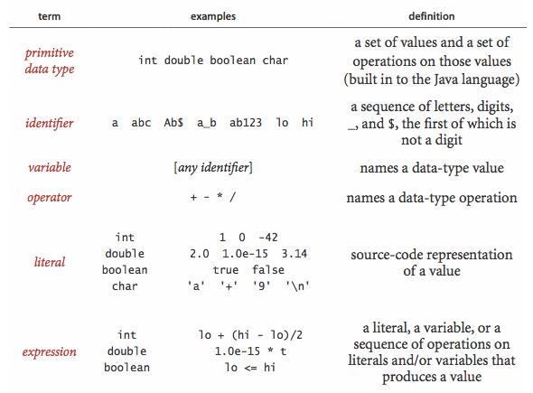
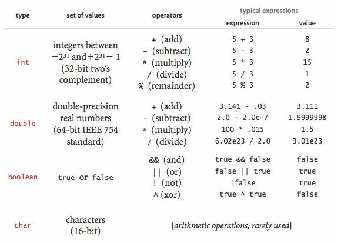

## Primitive data types, expressions

 A _data type_ is a set of values and a set of operations on those values. The following four primitive data types are the basis of the Java language:
 
- _Integers_, with arithmetic operations (int)
- _Real numbers_, again with arithmetic operations (double)
- _Booleans_, the set of values { _true_, _false_ } with logical operations (boolean)
- _Characters_, the alphanumeric characters and symbols that you type (char)

A Java program works with variables identified by unique names. Each variable is linked to a specific data type and holds a value that is valid for that type. Expressions are used to perform operations defined for each data type.

The following table summarizes the set of values and most common operations on those values for Java's int, double, boolean, and char data types.

**Expressions.** Most expressions in Java use infix notation. When an expression includes multiple operators, operator precedence determines the order of evaluation: the `*`, `/`, and `%` operators have higher precedence than `+` and `-`. Among logical operators, `!` has the highest precedence, followed by `&&`, and then `||`. In general, operators with the same precedence are left-associative, meaning they are evaluated from left to right. Parentheses can be used to override these precedence rules.

**Type Conversion.** Numbers are automatically converted to a more inclusive type when no information is lost. For instance, in the expression `1 + 2.5`, the integer `1` is promoted to the double value `1.0`, resulting in the expression evaluating to the double value `3.5`. A cast explicitly converts a value from one type to another. For example, `(int) 3.7` evaluates to `3`. Casting a double to an int truncates the value toward zero.

**Comparisons.** The following mixed-type comparison operators evaluate two values of the same type and return a boolean result:

- Equal (`==`)
- Not equal (`!=`)
- Less than (`<`)
- Less than or equal (`<=`)
- Greater than (`>`)
- Greater than or equal (`>=`)

**Other Primitive Types.** In Java, the `int` type uses a 32-bit representation, while the `double` type utilizes a 64-bit representation. Java also includes five additional primitive data types:

- **64-bit integers (`long`)**: Support arithmetic operations.
- **16-bit integers (`short`)**: Support arithmetic operations.
- **16-bit characters (`char`)**: Represent characters and support arithmetic operations.
- **8-bit integers (`byte`)**: Support arithmetic operations.
- **32-bit single-precision real numbers (`float`)**: Support arithmetic operations.

