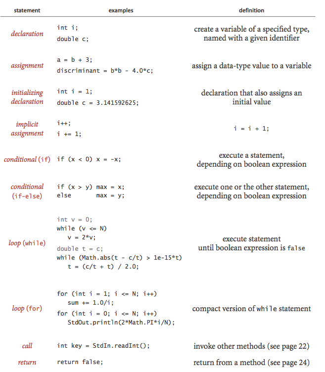

**Statements.** A Java program consists of statements that define the computation by creating and manipulating variables, assigning values to them, and controlling the flow of execution.

- **Declarations:** Create variables of a specific type and assign them identifiers. Java is strongly typed, meaning the compiler enforces type consistency. A variable's scope refers to the part of the program where it is defined.
    
- **Assignments:** Associate a variable with a data-type value, typically defined by an expression.
    
- **Initializing Declarations:** Combine a declaration and an assignment to initialize a variable at the time of declaration.
    
- **Implicit Assignments:** Shortcuts are available for modifying a variable’s value relative to its current value:
    
    - **Increment/Decrement Operators:** `i++` is shorthand for `i = i + 1`, and `++i` performs the same operation but evaluates the expression after the increment or decrement.
    - **Compound Operators:** `i /= 2` is shorthand for `i = i / 2`.
- **Conditionals:** Allow for a simple change in the flow of execution by executing one of two blocks of statements, depending on a specified condition.
    
- **Loops:** Provide a more significant change in execution flow by repeatedly executing a block of statements (the "body" of the loop) as long as a specified condition is true.
    
    - **Break Statement:** Exits the loop immediately.
    - **Continue Statement:** Skips the current iteration and starts the next iteration of the loop.
- **For Notation:** Simplifies loops that initialize an index variable, test a loop continuation condition, and increment the index variable. Such loops can be compactly written using the `for` syntax in Java.
    
- **Single-Statement Blocks:** For conditionals or loops, if the block contains only one statement, the curly braces `{}` may be omitted.
    

The table below summarizes different types of Java statements:

