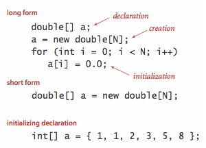

An **array** stores a collection of values, all of the same type. For an array with `N` elements, the notation `a[i]` is used to access the `i`th value, where `i` ranges from `0` to `N-1`.

- **Creating and Initializing an Array:** Creating an array in Java involves three key steps:
    
    1. Declaring the array's name and type.
    2. Allocating memory for the array.
    3. Initializing the array's elements.

- **Default Array Initialization:** To simplify code, Java allows us to combine these steps into a single statement. By default, numeric arrays are initialized with `0`, and `boolean` arrays are initialized with `false`.
    
- **Initializing Declarations:** You can specify the array's values at compile time by listing the literal values between curly braces, separated by commas.



**Using an Array:** Once an array is created, its size cannot be changed. The length of an array `a[]` can be accessed using `a.length`. Java automatically checks array bounds—if an invalid index is accessed, the program will terminate with an `ArrayIndexOutOfBoundsException`.

**Aliasing:** An array name represents the entire array. If one array name is assigned to another, both names will refer to the same array, as shown in the following code example:

```
int[] a = new int[N];
...
a[i] = 1234;
...
int[] b = a;
...
b[i] = 5678;   // a[i] is now 5678.
```

This scenario is referred to as **aliasing**, and it can result in subtle bugs since changes made through one reference affect the array seen by all other references.


**Two-Dimensional Arrays:** In Java, a two-dimensional array is essentially an array of one-dimensional arrays. While a two-dimensional array can be **ragged** (its rows may have different lengths), it is more common to work with **M-by-N arrays**, where all rows have the same length for specified values of `M` and `N`.

To access the element in row `i` and column `j` of a two-dimensional array `a[][]`, the notation `a[i][j]` is used.
