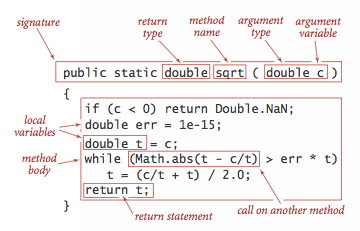

Static methods, often referred to as functions in various programming languages, operate similarly to mathematical functions. When invoked, a static method executes a series of statements in a sequential manner.

**Defining a static method**: A method is essentially a block of code designed to perform a specific computation, structured as a sequence of instructions. It accepts input arguments, which are values of specified data types, and either produces a return value of a particular data type or triggers a side effect. A static method consists of two main parts: a signature, which defines its name and parameters, and a body, which contains the executable statements.

**Invoking a Static Method**:  
To call a static method, you use its name followed by parentheses containing expressions that provide the argument values, separated by commas. When the method is invoked, the argument variables are assigned the values of these expressions. A `return` statement ends the execution of the method, transferring control back to the caller. If the method is designed to compute a value, this value must be specified in the `return` statement.

**Properties of Methods**:  
Java methods exhibit the following characteristics:

1. **Pass-by-value**: Arguments are passed by value, meaning the value of the argument is evaluated and copied into the method's parameter variable. This applies to object references as well—while the method cannot alter the reference itself, it can modify the contents of the object or array.
    
2. **Method Overloading**: Methods within the same class can share the same name if their signatures differ, a feature known as overloading.
    
3. **Single Return Value**: A method can only return one value, but it may include multiple `return` statements. The method exits as soon as the first `return` is executed.
    
4. **Side Effects**: Methods can have side effects, such as modifying system state or producing output. These methods use `void` as their return type to indicate they do not return a value.
    

**Recursion**:  
A recursive method is one that calls itself, either directly or indirectly. When designing recursive methods, keep these principles in mind:

- There must be a base case to terminate the recursion.
    
- Recursive calls should address smaller subproblems, ensuring progress toward the base case.
    
- Avoid overlapping subproblems to prevent inefficiency.
    

**Basic Programming Model**:  
A library of static methods consists of a collection of methods defined within a Java class. A common approach in Java programming is to create such a library to solve a specific task, with one method named `main()` serving as the entry point.

**Modular Programming**:  
Using libraries of static methods promotes modular programming, allowing methods from one library to call those in another. This approach offers several advantages:

- Working with manageable code modules.
    
- Reusing code without rewriting it.
    
- Easily replacing implementations with improved versions.
    
- Developing abstract models to solve programming problems.
    
- Simplifying debugging by isolating issues.
    

**Unit Testing**:  
A best practice in Java is to include a `main()` method in every library to test its functionality.

**External Libraries**:  
Java programs often rely on static methods from three types of libraries:

1. **Standard Libraries**: Found in `java.lang` (e.g., `java.lang.Math`, `java.lang.Integer`), these are always available without additional setup.
    
2. **Imported Libraries**: Libraries like `java.util.Arrays` require an `import` statement at the start of the program.
    
3. **Custom Libraries**: For example, libraries like `algs4.jar` need to be added to the Java classpath.
    

To call a method from an external library, prepend the library name to the method (e.g., `Math.sqrt()`, `Arrays.sort()`, `BinarySearch.rank()`, `StdIn.readInt()`).
